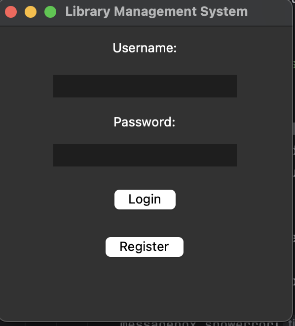
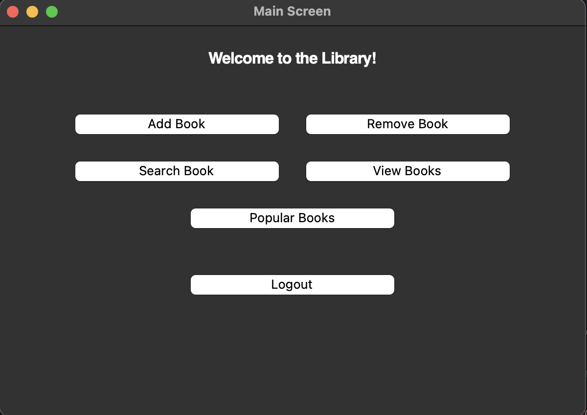
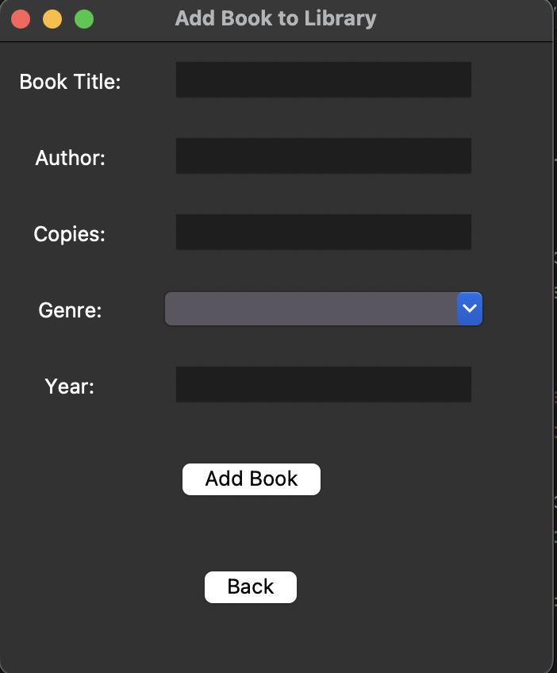
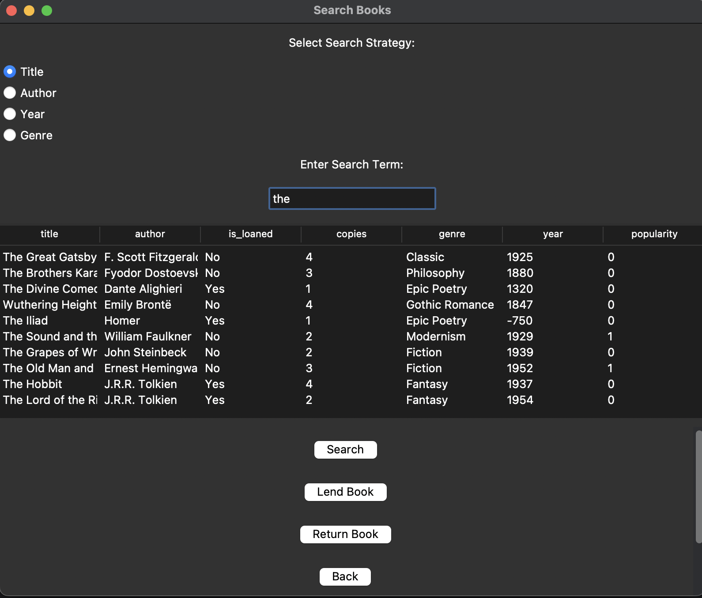
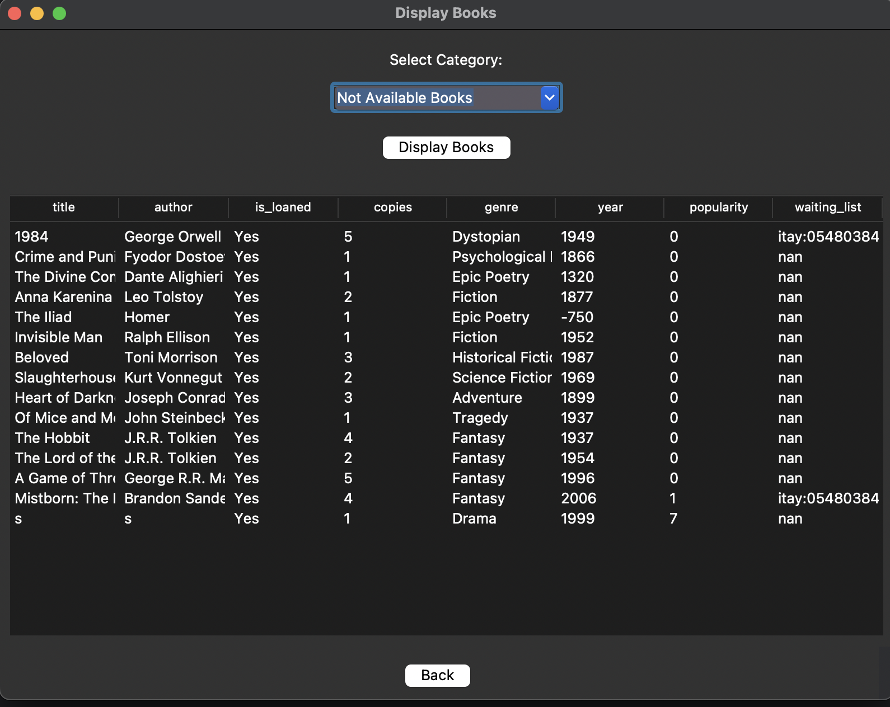

# 📚 Library Management System

A Python-based library management system implementing Object-Oriented Programming principles and design patterns. Created as part of a second-year Computer Science project.

## 🎯 Project Goals
- Implementation of OOP principles and design patterns
- Development of a complete library management system
- Creation of user-friendly interface
- Demonstration of software engineering best practices

## ⚡️ Quick Start

### Prerequisites
- Python 3.x
- pandas (for data management)
- tkinter (for GUI interface)

### Installation
```bash
# Clone repository
git clone https://github.com/your-username/library-management-system.git
```

### Install dependencies
```bash
pip install pandas
```
### Run application
```
python3 GUIMain.py
```
## 🏗️ Project Structure
```
library-management-system/
 ── src/
    ├── Gui/ # GUI implementation   # Core GUI functionality
    │   ├── [GUI Core Classes]      # GUI functionality
    │   └── GUIMain.py              # The Main class for GUI running
    ├── main_lib/                   # Core library functionality
    │   ├── Excel_Tables/           # Data storage
    │   └── [Core modules]          # Core library functionality
    └── Tests/                      # Test suite          
        ├──[Core Tests]             # All the Tests
        └──TestsSuite.py            # Main activate for all Tests
    
```

## 📊 Data Management
```python
Data Storage Structure:
├── books.csv                   # Master book database
├── available_books.csv         # Currently available books
├── not_available_books.csv     # Borrowed books & waiting lists
├── users.csv                   # User credentials (encrypted)
└── logger.log                  # System activity logs
```

## 🔒 Security & Authorization
- Role-based access control (Librarian roles)
- Password encryption and secure storage
- Activity logging and audit trail
- Session management
- Secure file operations

## 💡 Features & Design Patterns

### 1. Decorator Pattern (Logging System)
```python
@Logger.log_method_call("book borrowed")
def rent_books(self, book):
    """
    Handles book rental operations with automatic logging
    """
    try:
        # Rental logic
        success = process_rental(book)
        return success
    except Exception as e:
        Logger.log_add_message(f"Rental failed: {str(e)}")
        return False
```

### 2. Strategy Pattern (Search System)
```python
class SearchStrategy:
    def search(self, df, value):
        raise NotImplementedError()

class TitleSearch(SearchStrategy):
    def search(self, df, value):
        return df[df['title'].str.contains(value, case=False)]
```

### 3. Observer Pattern (Notification System)
```python
class LibraryObserver:
    def update(self, message):
        # Handle notification
        pass

class Library(Subject):
    def return_book(self, book):
        # Book return logic
        self.notify("Book returned and available")
```

### 4. Singleton Pattern (Library Management)
```python
class Library:
    __instance = None
    
    @staticmethod
    def get_instance():
        if Library.__instance is None:
            Library.__instance = Library()
        return Library.__instance
```

### 5. Factory Pattern (Book Creation)
```python
class BooksFactory:
    def create_books(self, title, author, copies, genre, year):
        if self._validate_input(title, author, copies, genre, year):
            return Books(title, author, "No", copies, genre, year, 0)
        return None
```

### 6. Iterator Pattern (Book Collection)
```python
class BookIterator:
    def __iter__(self):
        return self

    def __next__(self):
        if self.index >= len(self.collection):
            raise StopIteration
        book = self.collection[self.index]
        self.index += 1
        return book
```

## 📝 Waiting List System
- Automatic queue management for popular books
- Email and phone number collection
- Automatic notifications on book return
- Priority-based allocation
- Multiple waiting lists tracking

## 🖥️ GUI Interface Guide

### 1. Login Screen


- Secure user authentication
- New user registration
- Password encryption

### 2. Main Dashboard


- Centralized navigation
- Quick access to all features
- User role display
- System status indicators

### 3. Book Management


- Comprehensive book details
- Input validation
- Genre categorization
- Copy tracking

### 4. Search Interface


- Multiple search strategies
- Real-time results
- Advanced filtering
- Rental operations

### 5. Book Display


- Category-based views
- Status indicators
- Sorting capabilities
- Waiting list status

## 🧪 Testing
```python
class TestFramework:
    """
    Comprehensive test coverage includes:
    - Unit tests for all components
    - Integration testing
    - Edge case handling
    - Mock objects
    - File operation tests
    - Authentication testing
    """
```

## Running Tests
To run all tests:
```bash
PYTHONPATH=$PYTHONPATH:. python3 src/Tests/TestsSuite.py
```

## 🛡️ Technical Features
- Event-driven architecture
- Robust error handling
- Data validation
- File operation safety
- Session management
- Logging system

## 🔍 SOLID Principles
- **S**ingle Responsibility: Each class has one purpose
- **O**pen/Closed: Extensible search strategies
- **L**iskov Substitution: Interchangeable components
- **I**nterface Segregation: Minimal interfaces
- **D**ependency Inversion: Abstract dependencies

## 👥 Contributors
Created by:
- Itay Segev
- Salome Timsit

## 📄 License
This project is licensed under the MIT License.